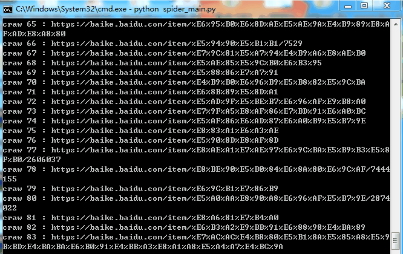
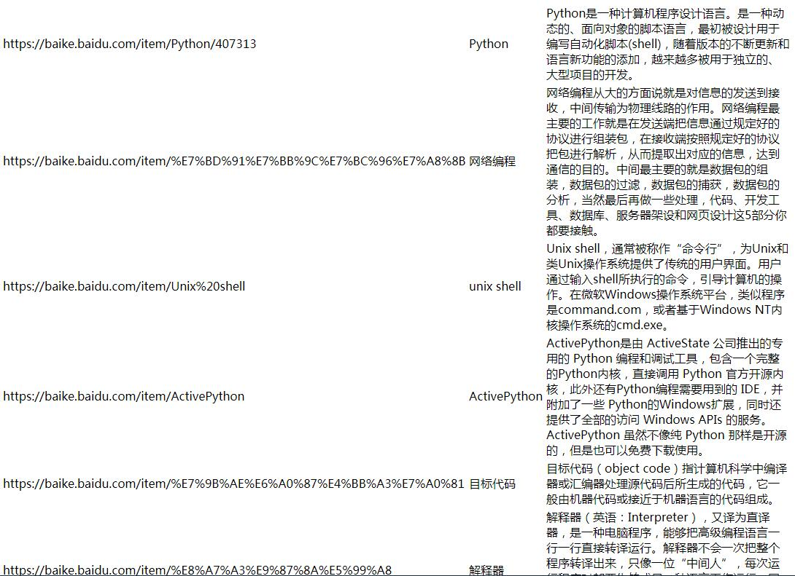

<h1 align="center" style="margin-bottom: 20px;">实战案例爬取百度百科1000条词条数据</h1>

作者: [雷小天博客](http://www.100txy.com)

# spider-baike
简单爬虫框架： 　爬虫调度器 -> URL管理器 -> 网页下载器(urllib2) -> 网页解析器(BeautifulSoup) -> 价值数据  实战案例爬取百度百科1000条词条数据

## 特性
该实例用的是Python3.7  
Python有哪几种网页解析器：  
正则表达式、html.parser、Beautiful Soup、lxml  

BeautifulSoup：  
　　- Python第三方库，用于从HTML或XML中提取数据  
　　- 官网：http://www.crummy.com/software/BeautifulSoup/bs4/doc/  

安装并测试beautifulsoup4：  
　　- 安装：pip install beautifulsoup4  
　　- 测试：import bs4  

如果PyCharm无法识别beautifulsoup4，则在设置里找到Python Intercepter这一项，改为python2.7版本即可。  

## 预览  

  
  
